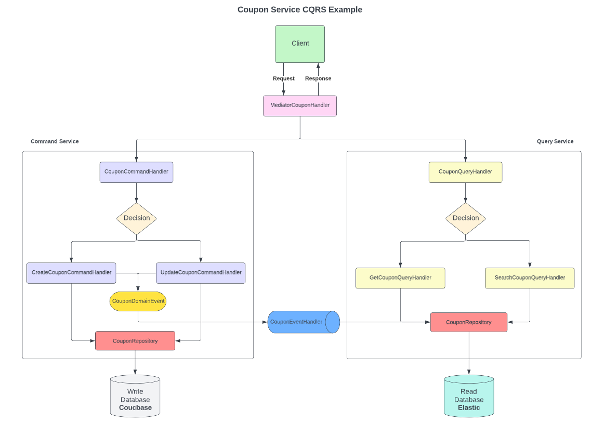

# CQRS Pattern Example

## What is it?
This is an example of CQRS Patten wrote in Java 17 and Spring Boot. I also used **mediator pattern** in order to isolate write and read flows from each other in one microservice. 
If you want to separate as two service, you can do it easily. I used **Couchbase** as write database and **Elasticsearch** as read database. You can see system diagram below. 

## References
* https://www.redhat.com/architect/illustrated-cqrs

## System Diagram
